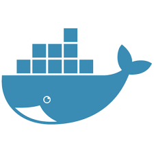

<p align="center">

</p>

# Curso Docker Básico
## Instrutor: Flávio Henrique Rocha

>[Introdução](unidade1/introducao.md)

>[Unidade 1 - Conceitos e fundamentos](unidade1/unidade1.md)

>[Unidade 2 - Ciclo de vida de Contêineres](unidade2/unidade2.md)

>[Unidade 3 - Construindo Imagens](unidade3/unidade3.md)

>[Unidade 4 - Persistindo dados com Volumes](unidade4/unidade4.md)

>[Unidade 5 - Trabalhando com Redes](unidade5/unidade5.md)

>[Unidade 6 - Integrando Contêineres com Docker Compose](unidade6/unidade6.md)

>[Unidade 7 - Introduzindo orquestração de contêineres](unidade7/unidade7.md)

---

## Instruções para Playgrounds

**Máquinas:** 10.200.6.X (X - Corresponde ao número identificado no seu desktop)
- **Usuário:** root
- **Senha:** docker

**Putty:** [Baixar](https://the.earth.li/~sgtatham/putty/latest/w64/putty.exe) ou acessar \\arquivos\BDS\ESTACOES\SOFTWARES\PuTTY.Ferramenta_Suporte\Portable\

### Configurar Registry

1. Edite o arquivo `/etc/docker/daemon.json` e inclua o conteúdo abaixo:

```
{
  "insecure-registries" : ["10.200.6.17:5000"]
}
```

2. Reinicie o daemon do Docker

```
$ systemctl restart docker
```

3. Realize o pull da imagem de teste

```
$ docker pull 10.200.6.17:5000/hello-world
```