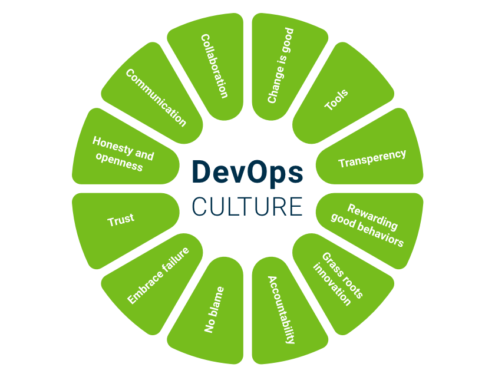
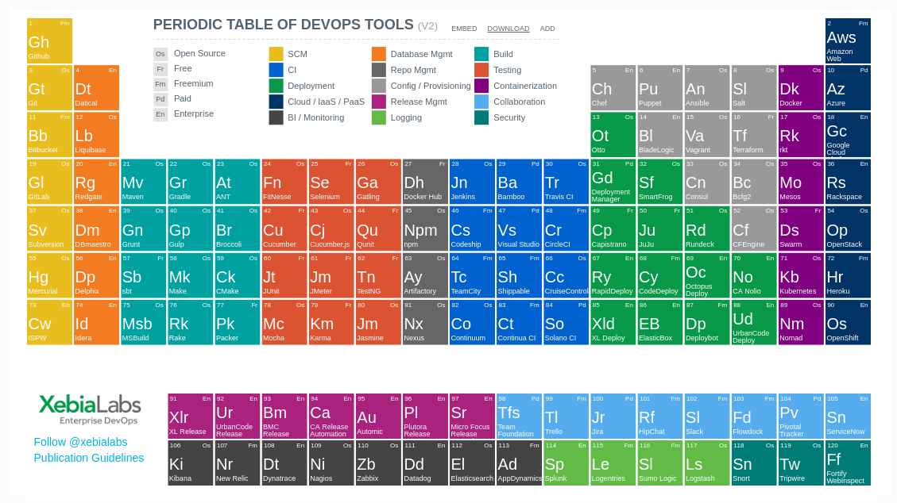

# Introdução

As tecnologias de virtualização têm desempenhado um papel de destaque no provisionamento de ambientes para execução de aplicações.

Isso impõe desafios, incluindo a escolha da tecnologia de virtualização e a configuração de consolidação adequadas para um conjunto específico de aplicativos.

A solução de virtualização mais utilizada é a tecnologia baseada em hipervisor (hypervisor), que tem como principais representantes o VMware, Microsoft Hyper-V e Xen.

Nos últimos anos tem-se visto uma crescente adoção, especialmente, por provedores de computação em nuvem, da virtualização baseada em contêineres.

A virtualização baseada em contêineres fornece um nível diferente de abstração em termos de virtualização e isolamento quando comparado com hipervisores.

Em particular, os contêineres podem ser considerados como uma alternativa leve à virtualização baseada em hipervisor. Os hipervisores abstraem o hardware, o que resulta em sobrecarga em termos de virtualização de hardware e drivers de dispositivos virtuais.

A popularização dessa tecnologia se deve ao **Docker**, que devido ao seu conjunto de recursos e facilidade de uso, rapidamente se tornou para a indústria e desenvolvedores a ferramenta de gerenciamento e o formato de imagem padrão para contêineres.

O uso de contêneires, em especial o Docker, no desenvolvimento e provisionamento de aplicações está relacionado a alguns termos e práticas. A ideia é conhecê-los e saber onde o a arquitetura de contêineres se encaixa.

E principalmente, **NÃO É NECESSÁRIO TER NADA DISSO PARA USAR DOCKER!**

## DevOps

- O DevOps é a combinação de filosofias culturais, práticas e ferramentas que visam aumentar a capacidade de uma empresa de distribuir aplicativos e serviços com maior velocidade, segurança e confiabilidade;

- O objetivo do DevOps é remover as barreiras entre duas equipes tradicionalmente separadas em silos: desenvolvimento e operações;

- Desenvolvimento procura aumentar o valor do negócio e a Infraestrutura é responsável por manter o valor do negócio;

- Equipes de desenvolvimento e infraestrutura trabalham mais integradas para otimizar a produtividade dos desenvolvedores e a confiabilidade das operações;

- A equipe se esforça para manter a comunicação frequente, aumentar a eficiência e melhorar a qualidades dos serviços disponibilizados aos clientes;

- O foco é utilizar práticas para automatizar processos que historicamente sempre foram manuais e lentos. Para isso é utilizada uma pilha de tecnologia e ferramentas que ajudam a operar e desenvolver aplicativos de modo rápido e confiável.

### Filosofia cultural do DevOps

#### Entrega rápida

  - Aumentar a frequência e o ritmo de lançamentos para que as equipes possam inovar e melhorar seu produto mais rapidamente;

  - Quanto mais rápido você puder lançar novos recursos e corrigir erros maior será a sua agilidade para responder às necessidades dos clientes;

  - Práticas relacionadas: integração e entrega contínuas.

#### Confiabilidade

  - Garantir a qualidade das atualizações de aplicativos e alterações de infraestrutura para que o produto possa ser entregue com confiança em um ritmo mais rápido, sem deixar de manter uma experiência positiva para os usuários finais;

  - Práticas relacionadas: testes automatizados de software na integração e a entrega contínuas; e práticas de monitoramento e registro em log.

#### Automação

  - Permite o gerenciamento de sistemas complexos ou dinâmicos com eficiência e risco reduzido;

  - Práticas relacionadas: infraestrutura como código e gerência de configuração.

#### Colaboração

  - As equipes de desenvolvedores e operações colaboram de perto, compartilham muitas responsabilidades e combinam seus fluxos de trabalho;

  - As equipes definem normas culturais sólidas com relação ao compartilhamento de informações, além de facilitar a comunicação por meio do uso de aplicativos de bate-papo, sistemas de rastreamento de problemas ou projetos, e wikis;

  - É necessário enfatizar os seguintes valores:

    - Confiança no trabalho em equipe;

    - Respeito pessoal e profissional por todos da equipe;

    - O problema e a solução são responsabilidades de todos;

    - Os resultados são o reflexo do trabalho de toda a equipe;

    - Sinceridade sobre eventos e incidentes ocorridos;

    - Honestidade sobre as causas dos incidentes;

    - Comunicação efetiva e dinâmica;

    - Postura construtiva sempre;

    - Espírito de colaboração.

#### Segurança

  - Operar rapidamente enquanto mantém o controle e preserva a conformidade e segurança;

  - Adotar políticas de segurança e conformidade automáticas, controles minuciosos e técnicas de gerenciamento de configuração;

  - Práticas relacionadas: infraestrutura e a política como código.

### Práticas do DevOps

Existem algumas práticas essenciais que ajudam as empresas a inovar mais rapidamente por meio da automação e da simplificação dos processos de desenvolvimento de software e gerenciamento de infraestrutura. As práticas do DevOps são detalhadas a seguir.

#### Atualizações pequenas e frequentes

  - Geralmente, essas atualizações são mais incrementais por natureza do que as atualizações ocasionais executadas de acordo com as práticas de lançamento tradicionais;

  - As atualizações frequentes, porém pequenas, diminuem o risco de cada implantação. Essas atualizações ajudam as equipes a analisar erros mais rapidamente, pois elas conseguem identificar a última implantação que provocou o erro;

#### Integração contínua

  - A integração contínua é uma prática de desenvolvimento de software em que os desenvolvedores, com frequência, juntam suas alterações de código em um repositório central e executam construções e testes automatizados das aplicações;

  - Os principais objetivos da integração contínua são encontrar e investigar erros mais rapidamente, melhorar a qualidade do software e reduzir o tempo necessário para validar e lançar novas atualizações de software.

  - O processo de construção e aplicação de testes são executados a cada nova modificação concluída (*commit*). Desta forma o desenvolvedor valida o impacto da alteração submetida.

#### Entrega contínua

  - A entrega contínua é uma prática de desenvolvimento de software em que alterações de código são criadas, testadas e preparadas automaticamente para liberação para produção;

  - Essa prática incorpora além de todas ações previstas na integração contínua, processos adicionais e necessários para que a modificação seja acessível a usuários e assim sejam realizadas inspeções finais, sejam elas manuais e/ou automatizadas;

  - O deploy em ambiente de produção não é automático, sendo é uma decisão de negócio a ser aprovada previamente;

  - Assim que um desenvolvedor entende que a sua modificação está pronta para seguir para as validações finais, é feito o deploy automatizado do novo código nos ambientes que antecedem o de produção, normalmente de qualidade e homologação;

  - Na sequência são executados testes complementares aos testes executados na fase de integração contínua. O deploy com a nova alteração pode então ser aceita ou rejeitada e notificações são enviadas;

  - No caso de inspeções manuais, equipes responsáveis pelas validações, como Controle de Qualidade, recebem lotes constantes e pequenos de trabalho que são facilmente validados. Caso um eventual erro seja detectado, o desenvolvedor será informado rapidamente enquanto ainda lembra dos detalhes de sua alteração;

  - Para que os processos da entrega contínua possam funcionar é imprescindível que a infraestrutura dos ambientes em que serão feitas as implantações e realizados os testes estejam sempre funcionais, para isso é comumente utilizada a prática de infraestrutura como código.

#### Infraestrutura como código

  - A infraestrutura como código é uma prática em que a infraestrutura é provisionada e gerenciada usando técnicas de desenvolvimento de código e software, como controle de versão e integração contínua;

  - O modelo controlado por API da nuvem permite que desenvolvedores e administradores de sistema interajam com a infraestrutura de modo programático e em escala, em vez de precisarem instalar e configurar manualmente os recursos;

  - Como são definidos por código, infraestrutura e servidores podem ser implantados rapidamente usando padrões normativos, atualizados com os patches e as versões mais recentes ou duplicados de modo repetitivo.

#### Gerenciamento de configuração

  - Os desenvolvedores e os administradores de sistema usam código para automatizar o sistema operacional e a configuração do host, as tarefas operacionais, e etc;

  - O uso do código torna as alterações de configuração repetidas e padronizadas. Isso isenta os desenvolvedores e os administradores de sistemas de ter que configurar manualmente sistemas operacionais, aplicativos de sistemas ou software do servidor.

#### Política como código

  - Com a infraestrutura e a sua configuração codificada com a nuvem, as empresas podem monitorar e aplicar a conformidade de modo dinâmico e em escala;

  - A infraestrutura, que é descrita pelo código, pode ser rastreada, validada e reconfigurada de modo automático. Isso torna mais fácil para as empresas administrarem as alterações de recursos e garantirem que as medidas de segurança foram aplicadas adequadamente de modo distribuído (por exemplo, segurança de informações ou conformidade com PCI-DSS ou HIPAA);

  - Os recursos fora de conformidade podem ser sinalizados automaticamente para serem investigados em mais detalhes ou, até mesmo, ter sua conformidade restabelecida de modo automático.

#### Monitoramento e registro em log

  - As empresas monitoram métricas e logs para ver como o desempenho do aplicativo e da infraestrutura afeta a experiência do usuário final do seu produto;

  - Ao capturar, categorizar e analisar dados e logs gerados pelos aplicativos e pela infraestrutura, as empresas compreendem como as alterações ou atualizações afetam os usuários, o que proporciona um esclarecimento sobre as causas raiz dos problemas ou das alterações inesperadas;

  - A criação de alertas ou a execução de análise em tempo real desses dados também ajuda as empresas a monitorar de modo mais proativo seus serviços.

### Ferramentas

 

##### Para saber mais:

>[O que é DevOps?](https://aws.amazon.com/pt/devops/what-is-devops/)

>[Diferenças entre integração, deploy e entrega contínua](https://www.4linux.com.br/diferencas-entre-integracao-deploy-e-entrega-continua)

>[HIPAA Compliance vs. PCI DSS Compliance](http://blog.securitymetrics.com/2014/05/hipaa-vs-pci-dss.html)

## Microsserviços

- A arquitetura de microsserviços é uma abordagem de projeto para a criação de um aplicativo único como um conjunto de pequenos serviços;

- Os aplicativos são divididos em vários componentes individuais (serviços) que interagem uns com os outros pela rede;

- Cada serviço é executado em seu próprio processo e se comunica com outros serviços por meio de uma interface bem definida usando um mecanismo leve, geralmente uma interface de programação de aplicativo (API) baseada em HTTP;

- Esses serviços são construídos com base em necessidades de negócio e funcionam através de mecanismos de deploy independentes e automatizados (em um cenário ideal);

- Há o mínimo possível de gerenciamento centralizado desses serviços, que podem ser escritos em diferentes linguagens de programação e utilizar diferentes tecnologias de armazenamento de dados;

- Para softwares tradicionais (monolíticos) quando uma alteração é feita em uma pequena parte do software, é necessário que todo ele seja reconstruído e que o deploy seja refeito;

- Existe um grande ponto único de falha em sistemas monolíticos, isso significa que se houver algum erro em uma funcionalidade específica do sistema que deixe o sistema fora do ar, isso vai levar junto todo o sistema, incluindo outras funcionalidades que não possuem nenhuma relação com aquela com defeito;

- Outro ponto negativo nos monolítos é a sua base de código, que se torna muito extensa, podendo deixar novos membros do projeto menos produtivos por algum tempo, já que a complexidade do código é bem maior;

- O escalonamento de uma aplicação monolítica requer o redimensionamento de todo o aplicativo, ao invés de apenas de partes que exigem mais recursos. O que pode ser feito adicionando mais recursos no mesmo servidor (escala vertical) ou fazer cópias desse servidor e colocá-las atrás de um balanceador de carga (escala horizontal);

- Como os serviços são implantados de maneira independente, o escalonamento se dá de forma individual, tanto na vertical quanto na horizontal, para os serviços que estão precisando de mais desempenho;

- A combinação de microsserviços e uma maior frequência de lançamentos resulta em um número significativamente maior de implantações que podem apresentar desafios operacionais, mitigados por meio das práticas de DevOps, tais como a integração e a entrega contínuas;

- O uso de microsserviços pode aumentar a complexidade geral da arquitetura, devido a interação entre os componentes individuais em sistemas com uma elevada quantidade de serviços;

- A natureza leve e a velocidade dos contêineres indicam que eles são particularmente adequados para executar uma arquitetura de microsserviços. Em comparação com as VMs, os contêineres são muito menores e mais rápidos de implantar, permitindo que as arquiteturas de microsserviços usem o mínimo de recursos e reajam com velocidade a mudanças na demanda.

##### Para saber mais:

>[Microservices: a definition of this new architectural term - Martin Fowler](https://martinfowler.com/articles/microservices.html)

>[Introdução à Arquitetura de Micro Serviços](http://www.luiztools.com.br/post/introducao-arquitetura-de-micro-servicos/)

---

<a href='unidade1.md' id='unidade1' class='anchor' aria-hidden='true'>Unidade 1 - Conceitos e fundamentos >></a>

