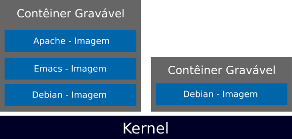
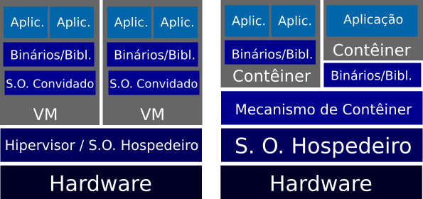
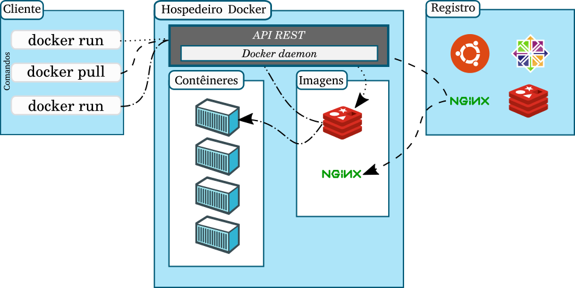
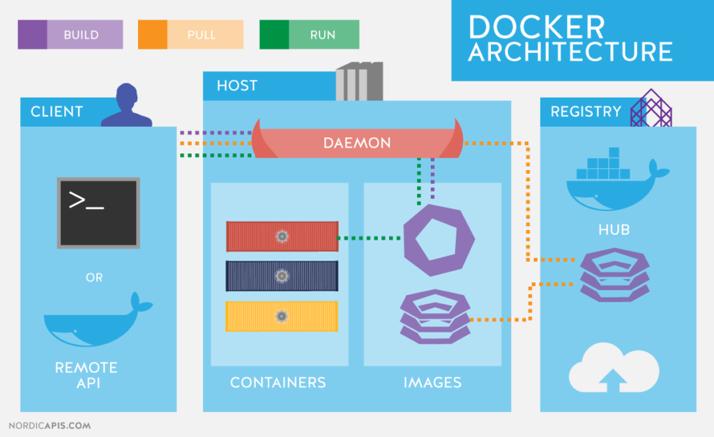
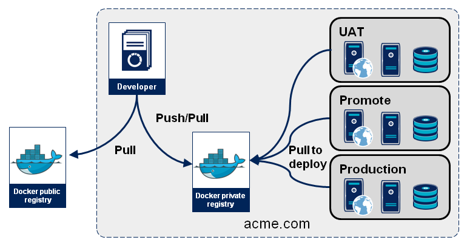
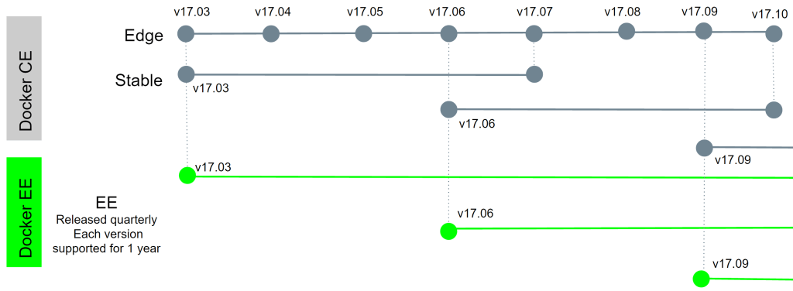
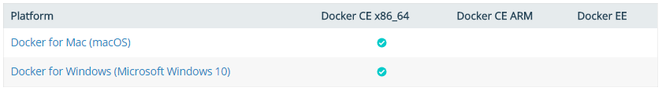
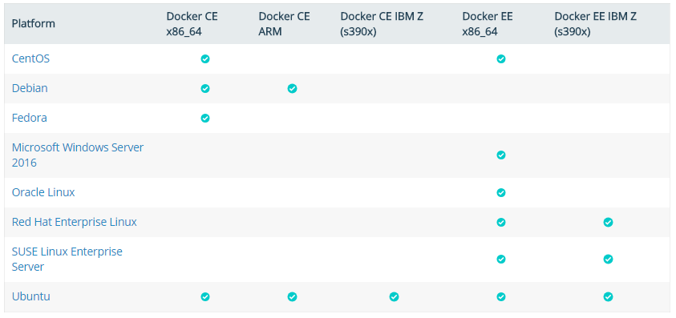

# Conceitos e fundamentos

- [Visão geral da tecnologia de contêineres.](#visão-geral-da-tecnologia-de-contêineres)
- [Evolução da tecnologia de contêineres.](#evolução-da-tecnologia-de-contêineres)
- [Diferenças entre contêineres e máquinas virtuais.](#diferenças-entre-contêineres-e-máquinas-virtuais)
- [Docker: conceito e base tecnológica.](#docker)
- [Visão geral da Arquitetura do Docker: Engine, Images, Registries e Containers.](#visão-geral-da-arquitetura-do-docker)
- [Instalação do Docker (Linux, Docker Toolbox e Windows 10)](#instalação-do-docker)

## Conceitos relacionados

## Visão geral da tecnologia de contêineres.

### Conceito

> A tecnologia de contêineres visa prover uma unidade de computação auto-suficiente para execução de uma aplicação em um ambiente computacional.

- Um contêiner encapsula o aplicativo e suas dependências, permitindo que ele seja executado de forma isolada das outras aplicações em um mesmo computador.

- São executados a partir do sistema operacional (SO) hospedeiro em espaços próprios e isolados providos pelo núcleo (kernel).

- São baseados em camadas feitas de imagens individuais construídas sobre uma imagem de base que pode ser estendida.

<!---->
<p align="center">

</p>

- O ecossistema mínimo de contêineres consiste em um:  
  * Mecanismo para construção e execução de imagens;

  * Um repositório ou registro para transferir essas imagens de/e para os ambientes de execução instalados em um computador hospedeiro.

### Vantagens

<!--Um sistema operacional completo (por exemplo, Linux) normalmente é executado no topo deste hardware virtualizado em cada instância de máquina virtual. Em contraste, os contêineres implementam isolamento de processos no nível do sistema operacional, evitando assim tais sobrecargas. Esses contêineres são executados em cima do mesmo {\it kernel} do sistema operacional compartilhado da máquina {\it host} subjacente, e um ou mais processos podem ser executados dentro de cada contêiner~\cite{Morabito2015_7092949}.

A popularização dessa tecnologia se deve ao Docker~\cite{what_docker}, que devido ao seu conjunto de recursos e facilidade de uso, rapidamente se tornou para a indústria e desenvolvedores a ferramenta de gerenciamento e o formato de imagem padrão para contêineres. O aumento do investimento nesse tipo de tecnologia se deve a fatores demonstrados pelo seu uso tais como~\cite{Mouat2015}: -->

- **Eficiência no uso de recursos computacionais** (processamento, memória e armazenamento)  - permitindo uma maior velocidade na inicialização e na interrupção das aplicações com pouca ou nenhuma sobrecarga em comparação com aplicativos executados nativamente no SO hospedeiro;


<!-- - pois os contêineres compartilham os referidos recursos com o sistema operacional (SO) hospedeiro, permitindo uma maior velocidade na inicialização e na interrupção das aplicações, com pouca ou nenhuma sobrecarga em comparação com aplicativos executados nativamente no SO hospedeiro;-->

- **Portabilidade e previsibilidade** - devido ao encapsulamento da aplicação e suas dependências em um contêiner, bem como a sua distribuição por meio de imagens, a eliminação de diversos erros promovidos por mudanças sutis no ambiente de execução é potencializada;

- **Produtividade para equipes de desenvolvedores na criação de aplicações** - seu uso minimiza preocupações referentes a configuração de ambientes na realização de testes, no qual se pode emular um sistema distribuído em produção com facilidade.

## Evolução da tecnologia de contêineres

- 1979 - Chroot no sistema operacional UNIX

- 1998 - FreeBSD Jails

- 2001 - Linux VServer

- 2005 - Solaris Zones e OpenVZ

- 2006 - CGroups

- 2008 - LXC (LinuX Containers)

- 2011 - Warden

- 2013 - Docker

- 2014 - Rocket (rkt)

- 2015 - Windows Containers e  Open Container Initiative (OCI)

## Diferenças entre contêineres e máquinas virtuais

Os objetivos básicos das VMs e dos contêineres são diferentes:

- A finalidade de uma VM é emular totalmente um ambiente computacional externo;

- O objetivo de um contêiner é tornar os aplicativos portáveis e independentes.

As máquinas virtuais e contêineres apresentam uma interface de sistema operacional para execução dos programas, onde:

- As máquinas virtuais são uma abstração de um hardware físico, que possui uma implementação completa de um sistema operacional qualquer;

- Os contêineres tem uma visão de "fatias" de um sistema operacional já em execução. Com os contêineres, as aplicações compartilham um sistema operacional (e, quando apropriado, binários e bibliotecas) e, como resultado, essas implantações serão significativamente menores em tamanho do que em uma VM utilizando um hipervisor.

<!---->
<p align="center">

</p>

##### Para saber mais: 

> [Docker for the Virtualization Admin](base%20de%20conhecimento/Docker-for-Virtualization-Admin-eBook.pdf)

> [IBM Research Report - An Updated Performance Comparison of Virtual Machines and Linux Containers](base%20de%20conhecimento/an-updated-performance-comparison-of-virtual-machines-and-linux-containers.pdf)

> [Avaliação de Desempenho de Contêineres Docker para Aplicações do Supremo Tribunal Federal](base%20de%20conhecimento/Avaliação%20de%20Desempenho%20de%20Contêineres%20Docker%20para%20Aplicações%20do%20Supremo%20Tribunal%20Federal.pdf)

## Docker

### Conceito

> O Docker é uma plataforma aberta para desenvolvimento, entrega e execução de aplicativos por meio de contêineres criada e mantida pela empresa Docker Inc.

O ecossistema do Docker abrange:

- **Docker Engine:** mecanismo de criação de imagens e de execução de contêineres;

- **Docker Registries:** repositórios para armazenamento e distribuição de imagens o que inclui um serviço em nuvem chamado Docker Hub. O Docker Hub disponibiliza um grande número de imagens de contêineres públicas para download;

- **Docker Swarm:** uma ferramenta de gerenciamento de clusters e orquestração de contêineres.

### Base tecnológica

O Docker é escrito na linguagem Go e faz uso de diversos recursos do núcleo do sistema operacional para prover a tecnologia de contêineres. São elas:

- **Control groups (cgroups):** compartilhamento de recursos do hardware e, caso necessário, definição de limites e restrições;

- **Namespaces:** provê isolamento dos contêineres (processos, rede, controle de recursos IPC, pontos de montagem e recursos do kernel);

- **Union file systems (UnionFS):** são sistemas de arquivos que funcionam por meio da criação de camadas. O UnionFS mescla as camadas por prioridade e expõe como uma árvore de diretórios única.

<!-- Docker Engine combina os namespaces, cgrups UnionFS em um _wrapper_ chamado de formato de contêiner. O formato de contêiner padrão é o **libcontainer**.-->

## Visão geral da Arquitetura do Docker

### Docker Engine

O Docker Engine usa uma arquitetura cliente-servidor composta de três componentes:

- **Daemon:** processo executado em segundo plano que cria e manipula os objetos Docker tais como imagens, contêineres, rede e volumes de dados.


- **API REST:** especifica as interfaces que os programas podem utilizar para interagir com o daemon. O cliente faz uso da API REST para executar operações com o daemon.

- **Cliente (CLI):** aplicação binária onde são executados comandos para interagir com o daemon do Docker;

<!---->

<!--p align="center">

</p-->

<p align="center">

</p>

Em resumo, o cliente conversa com o daemon, que realiza o trabalho de construir, executar e distribuir as imagens e os contêineres.

O cliente e o daemon podem ser executados no mesmo sistema ou um cliente pode se conectar a um daemon Docker em um host remoto. O cliente Docker e o daemon se comunicam usando a API REST, por meio de soquetes UNIX ou uma interface de rede.

### Docker Images

- Imagem Docker é um modelo de somente leitura a partir do qual os contêineres são instanciados.

- Cada imagem consiste em uma série de camadas (layers). Essas camadas são combinadas em um único filesystem consistente por meio da tecnologia UnionFS.

- Toda imagem é construída a partir de uma imagem base. Essas imagens base podem ser construídas a partir de uma imagem vazia (scratch) ou de outras imagens pré-construídas.

<p align="center">

</p>

- São construídas usando um conjunto simples, descritivo de passos chamados de instruções. Cada instrução cria uma nova camada e a adiciona à imagem.

- As instruções incluem ações como executar um comando de linha, adicionar um arquivo ou pasta, criar uma variável de ambiente e qual o processo a ser executado ao iniciar um contêiner criado a partir desta imagem.

- Estas instruções são armazenadas em um arquivo chamado de **Dockerfile**. Quando é solicitada uma compilação de uma imagem, o Docker Engine lê esse arquivo, executa as instruções e retorna uma imagem final.

Exemplo

```Dockerfile
# Imagem base
FROM alpine:3.5

# Instalação python and pip
RUN apk add --update py2-pip

# upgrade pip
RUN pip install --upgrade pip

# instalação dos módulos Python necessários para a aplicação
COPY requirements.txt /usr/src/app/
RUN pip install --no-cache-dir -r /usr/src/app/requirements.txt

# cópia dos arquivos requeridos para a execução da aplicação
COPY app.py /usr/src/app/
COPY templates/index.html /usr/src/app/templates/

# informa o número da porta do contêiner que deve ser exposta
EXPOSE 5000

# executa a aplicação
CMD ["python", "/usr/src/app/app.py"]
```


<!--**Comandos para manipulação de imagens Docker**

#### Constroi uma imagem a partir do Dockerfile

```
$ docker image build [-t NOME] .
```

#### Lista as imagens presentes no host

```
$ docker image ls
```

#### Remove imagem do host

```
$ docker image rm [OPÇÕES] NOME/ID

Opções:

  -f      Força a remoção da imagem
```
#### Exibe histórico de criação de imagem (camadas)

```
$ docker image history NOME/ID
```
#### Exibe informações detalhadas sobre as imagens

```    
$ docker image inspect NOME/ID
```
-->
### Docker Registries

- Registro Docker é um repositório para armazenamento e distribuição de imagens previamente criadas.

- Depois das imagens construídas pode ser realizado o upload para o registry. O cliente Docker é utilizado para procurar por imagens já publicadas e realizar o download {\it pull}  para executar contêineres a partir delas.

- A Docker Inc fornece um registry público chamado **Docker Hub**. 
Esse registro público possui uma enorme coleção de imagens criadas por desenvolvedores e empresas para download.

- Os registros privados tem acesso permitido somente a usuários autorizados e residem normalmente em uma rede própria protegida por um firewall.

Os Registros Docker são usados com os objetivos de:

- Integrar o armazenamento e distribuição de imagens no fluxo de trabalho interno de desenvolvimento; e

- Operacionalizar o processo de entrega contínua das aplicações em contêineres.


<p align="center">

</p>

<!--

**Comandos para utilização de registros Docker**

#### Baixa imagem do registry

```
$ docker image pull [OPÇÕES] [REGISTRO PRIVADO/] NOME [:TAG]
```

#### Sobe imagem para o registry

```
$ docker image push [OPÇÕES] [REGISTRO PRIVADO/] NOME [:TAG]
```

#### Realiza login no registry privado

```
$ docker login [REGISTRO PRIVADO]
```
-->

### Docker Containers

- Um contêiner consiste em um sistema operacional, os arquivos adicionados pelo usuário e metadados.

- Na imagem, da qual o contêiner é instanciado, é definido o processo a ser executado quando ele é iniciado e uma variedade de outros dados de configuração.

- A imagem Docker é somente leitura. Quando o Docker inicializa um contêiner a partir de uma imagem, ele adiciona uma camada de leitura e escrita na parte superior da imagem (usando {\it UnionFS}), no qual a aplicação pode ser executada.

- Diversas operações podem ser efetuadas em um contêiner, tais como iniciar, parar, mover e excluir.

<p align="center">

</p>

**Operações efetuadas pelo Docker Engine para a execução de um contêiner**

1. O Docker Engine verifica a presença da imagem solicitada. Se a imagem já existir, então o mecanismo do Docker a utiliza para executar o novo contêiner. Se ela não existir localmente na máquina, então o Docker Engine realiza o download do registro;

1. O contêiner é criado no file system e a camada de leitura e escrita é adicionada a imagem;

1. É criada uma interface de rede que permite que o contêiner Docker se comunique com o host hospedeiro;

1. Executa-se o programa definido na imagem e o mecanismo do Docker passa a capturar as informações da entrada e saída padrão do contêiner e erros da aplicação em execução.

<!--**Comandos para criação e operação de contêineres Docker**

#### Executa o contêiner a partir da imagem

```
$ docker container run [OPÇÕES] [REGISTRO PRIVADO/] IMAGEM[:TAG] [COMANDO] [ARG...]

Opções:

  -d          Execução do container em background
  -i          Modo interativo. Mantém o STDIN aberto.
  -t          Aloca uma pseudo TTY
  –-rm        Remove o container após finalização 
              (Não funciona com -d)
  –-name      Atribui um nome ao contêiner
```

#### Exibe os contêineres em execucao

```    
$ docker container ls [OPÇÕES]

Opções:

  -a, --all             Exibe todos os contêineres (padrão exibe somente em execução)
  -f, --filter          Filtra a saída de acordo com condições definidas
  --format string       Formata saída usando um template Go
  -n, --last int        Mostra n últimos contêineres criados (inclui todos os estados) (default -1)
  -l, --latest          Mostra o último contêiner criado
  --no-trunc            Não trunca a saída
  -q, --quiet           Mostra apenas IDs númericos

```

#### Inicializa e finaliza um contêiner

```
$ docker container start NOME/ID
    
$ docker container stop NOME/ID
```

#### Exibe informações detalhadas sobre os contêineres

```    
$ docker container inspect NOME/ID
```

#### Exibe informações detalhadas sobre os contêineres

```    
$ docker container inspect NOME/ID
```

#### Remove contêineres do host

```
$ docker container rm [OPÇÕES] NOME/ID

Opções:

  -f, --force     Força a remoção de contêineres em execução (usa SIGKILL)
  -v, --volumes   Remove volumes associados ao contêiner
```

#### Executa comandos em um contêiner

```
$ docker container exec [OPÇÕES] NOME/ID COMANDO [ARG...]

Opções:

  -d          Execução o comando em background
  -i          Modo interativo. Mantém o STDIN aberto
  -t          Aloca uma pseudo TTY
  -u          Define um usuário ou UID para execução
  -e          Define váriaveis de ambiente
```
-->
## Instalação do Docker

Docker está disponível em duas versões: 

- Community Edition (CE):  versão gratuita, completamente funcional. Possui duas variantes:

  - Edge: disponibiliza novos recursos mensalmente;

  - Stable: oferece atualizações confiáveis a cada trimestre.

- Enterprise Edition (EE): versão paga, oferece uma plataforma de contêineres integrada, suportada e certificada pela Docker Inc. e parceiros.

  - Releases trimestrais, suportados por um ano com correções e hotfixes;

  - Tecnologia certificada: Infraestrutura, plugins e containers;

  - Docker Datacenter e Docker Store;

  - Disponível para CentOS, Red Hat Enterprise Linux (RHEL) Ubuntu, SUSE Linux Enterprise Server (SLES), Oracle Linux e Windows Server 2016, bem como para fornecedores de nuvem AWS e Azure.

<p align="center">

</p>

### Plataformas suportadas

#### Desktop

<p align="center">

</p>

#### Server

<p align="center">

</p>

### Instalação no Linux (CentOS)

#### Configuração do repositório

```
$ yum install -y yum-utils

$ yum-config-manager \
    --add-repo \
    https://download.docker.com/linux/centos/docker-ce.repo  
```

#### Instalar Docker CE

```
$ yum install docker-ce

$ systemctl start docker

$ docker system info
```

#### Testar a instalação

```
$ docker container run hello-world
```
<!--
##### Habilitar repositórios Edge e Test

```
$ yum-config-manager --enable docker-ce-edge

$ yum-config-manager --enable docker-ce-test
```

##### Desabilitar repositório

```
$ yum-config-manager --disable docker-ce-edge
```
-->

### Instalação no Windows

#### Docker Toolbox

O Docker Toolbox é um conjunto de ferramentas para instalação e utilização de um ambiente Docker em Windows (ou Mac, veja mais [aqui]()) nas versões de 7, 8 e 8.1 nas versões 64 bits.

O Docker Toolbox inclui as seguintes ferramentas Docker:

- Cliente Docker CLI: para executar o Docker Engine para criar imagens e contêineres

- Docker Compose: para executar contêineres Docker em conjunto;

- Kitematic: o interface gráfica para gerenciamento do Docker;

- Docker QuickStart: shell pré-configurado para um ambiente de linha de comando do Docker

- Docker Machine: para criar e executar a uma máquina virtual otimizada. Nessas versões de Windows não é possível executar o Docker Engine nativamente, pois o daemon do Docker Engine usa recursos de kernel específicos do Linux. Essa VM Linux fica encarregada de executar o Docker no sistema Windows.

- Oracle VM VirtualBox

> [Procedimento de instalação do Docker Toolbox](https://docs.docker.com/toolbox/toolbox_install_windows/)

#### Docker for Windows

Em 2015 a Microsoft também tomou a iniciativa de adicionar suporte a contêineres ao sistema operacional Windows usando as APIs e o cliente do Docker.

São características do Docker for Windows:

- Os contêineres do Windows incluem dois tipos diferentes: Windows Server Containers e contêineres Hyper-V;

- Os contêineres Windows Server fornecem isolamento de aplicativos através da tecnologia de isolamento de processos e namespaces. Esse tipo de contêiner compartilha o kernel do SO com o hospedeiro e todos os contêineres executados na máquina;

- No tipo Hyper-V cada contêiner é executado em uma máquina virtual altamente otimizada. Nessa configuração, o kernel do host não é compartilhado com os contêineres;

- O Docker para Windows requer 64 bits do Windows 10 Pro, Enterprise ou Education com o Hyper-V habilitado;

- Os contêineres e as imagens criadas com o Docker para Windows são compartilhadas entre todas as contas de usuários em máquinas onde está instalada. <!-- Isso ocorre porque todas as contas do Windows usarão a mesma VM para criar e executar contêineres. No futuro, o Docker para Windows irá isolar melhor o conteúdo do usuário.-->

- A instalação do Docker for Windows fornece o Docker Engine, o cliente Docker CLI, Docker Compose, Docker Machine e Kitematic.

> [Procedimento de instalação do Docker for Windows](https://docs.docker.com/docker-for-windows/install/)

#### Play with Docker

Play with Docker é uma ferramenta que permite a criação de instâncias de máquinas na nuvem para testes com o Docker.

Essas máquinas temporárias são disponibilizadas com o sistema operacional Alpine Linux. É possível a criação de contêineres Docker e clusters com o modo Swarm.

[Acesse o Play with Docker](http://play-with-docker.com/)

##### Para saber mais:

>[Instalação do Docker](https://docs.docker.com/engine/installation/)

>[Passos pós-instalação no Linux](https://docs.docker.com/engine/installation/linux/linux-postinstall/)

>[Containers: Docker, Windows and Trends](https://azure.microsoft.com/pt-br/blog/containers-docker-windows-and-trends/)

## Let's play! 
>[Playground 1](playground/play1.md)

---
<p align="left">
<a href='../unidade1/introducao.md' id='introducao' class='anchor' aria-hidden='true'><< Introdução</a></p>
<p align="right">
<a href='../unidade2/unidade2.md' id='unidade2' class='anchor' aria-hidden='true'>Unidade 2 - Ciclo de vida de Contêineres >></a></p>

