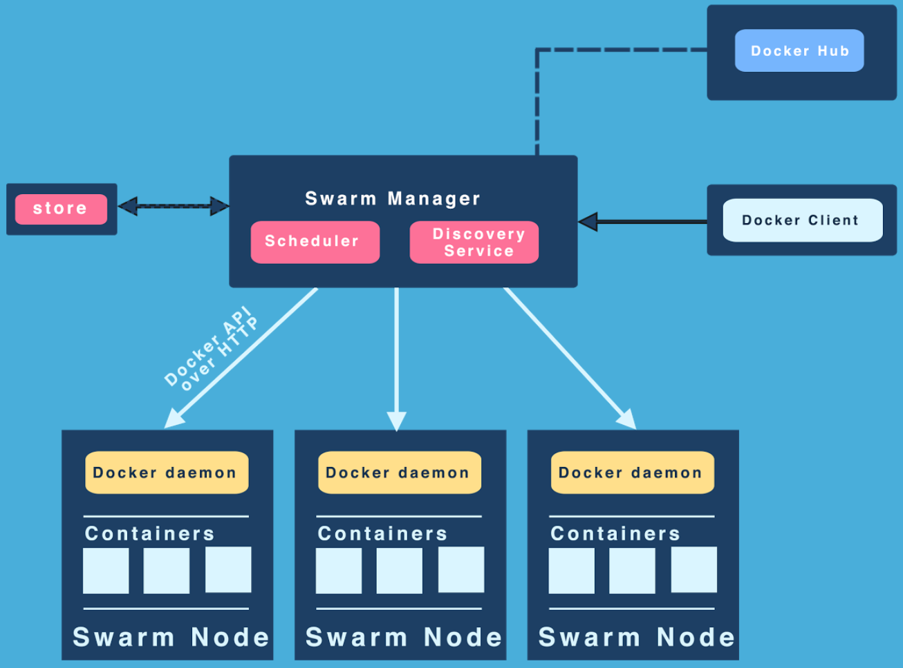
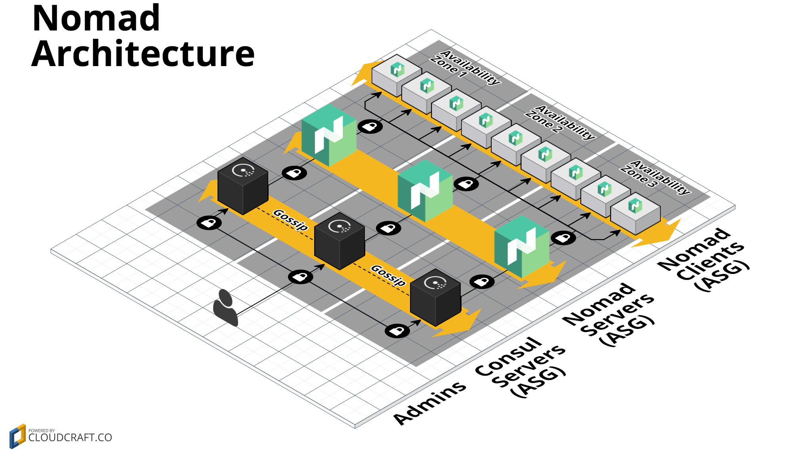

# Introduzindo orquestração de contêineres 

[Conceitos básicos](#conceitos-básicos)

[Ferramentas de orquestração](#ferramentas-de-orquestração)

[Um visão sobre o Docker Swarm](#um-visão-sobre-o-docker-swarm)

## Conceitos básicos

Conforme foi visto no decorrer do curso, os aplicativos podem ser compostos de dúzias ou centenas de componentes livremente acoplados em contêineres que precisam trabalhar em conjunto, para que um determinado aplicativo funcione como o desejado.

A forma de utilização de contêineres Docker, vista até o momento, está vinculada a um host específico e não pode ser facilmente distribuída ou escalada em vários hosts.

Para criar um sistema altamente disponível é necessário executar muitas instâncias de contêiner, conectadas em rede, espalhadas por múltiplos hosts.

Diante desse cenário, enfrentam-se desafios que acompanham sistemas distribuídos, tais como escalação,replicação, tolerância a falhas e comunicação transparente entre os contêineres.

Para solucionar essas questões são utilizadas ferramentas que possibilitem as seguintes funções:

- **_Clustering_**: Agrupar hosts e gerenciá-los de forma unificada. Essa função permite abstrair qual host hospedará um contêiner em particular, .

- **_Orquestração_**: Coordenar a execução conjunta dos contêineres, orientando a implantação distribuída de contêineres e automatização de tarefas de atualização, escalonamento, monitoramento de integridade, procedimentos de failover e rebalanceamento das cargas entre os hosts.

As plataformas ou ecossistemas que provêm as funções acima são chamados, de forma genérica, de **orquestradores de contêineres**.

Esses orquestradores fornecem uma estrutura de suporte e infraestrutura que incluem diversos serviços de armazenamento, rede, segurança, gerenciamento, balanceamento de carga, provisionamento, agendamento, gerenciamento de ciclo de vida, gerenciamento de patches, implantação, automação, monitoramento, agregação de logs e roteamento.

Destacam-se entre esses serviços:

- **Provisionamento:** processo de se incluir novos hosts no cluster;

- **Gerenciamento:** processo de controle dos membros do cluster, de modo a garantir a sua integridade. Geralmente é relacionado com a utilização de repositório distribuído de valores-chave;

- **Agendamento:** atividade de inicialização de contêineres nos hosts remotos. Faz parte dessa atividade, o processo de seleção de qual o host hospedará um contêiner baseado em políticas definidas, seja pela quantidade de recursos disponíveis ou por restrições definidas pelo usuário;

- **Rede:** processo de conexão entre contêineres distribuídos em múltiplos hosts de forma transparente. Portanto, o mecanismo de rede encapsula o tráfego dentro de mensagens que se parecem com uma comunicação host-host normal. Existem várias maneiras de fazer isso, mas o mais popular é a Rede de Área Local Extensível Virtual (VXLAN);

- **Descoberta de serviço:** processo de fornecer automaticamente aos clientes (aplicativos ou outros serviços) informações de conexão, geralmente endereço IP e porta, de uma instância apropriada do serviço.

##### Para saber mais

> [O Ecossistema do Docker: Agendamento e Orquestração](https://www.digitalocean.com/community/tutorials/o-ecossistema-do-docker-agendamento-e-orquestracao-pt)

> [The DZONE Guide to Orchestrating and Deploying Containers
](base%20de%20conhecimento/dzone-guidetoorchestratinganddeployingcontainers.pdf)


## Ferramentas de orquestração

### Docker Swarm


Desde a versão 1.12, o Docker Engine inclue o modo swarm para gerenciar nativamente um cluster Docker. 

Características:

- Gerenciamento de cluster integrado com o Docker Engine;

- Divisão de atividades para os membros do cluster: managers (gerenciadores) e workers (executores);

- Facilidade de implantação por meio da Docker CLI;

- Modelo de serviço declarativo que permite a definição do estado desejado dos vários serviços em sua pilha de aplicativos;

- Escalabilidade de serviços por meio de definição de número de réplicas;

- Rede multi-host (overlay);

- Descoberta de serviço implementada por meio de DNS interno;

- Balanceamento de carga utilizando balanceador de carga externo;

- Segurança por meio de autenticação e criptografia mútua TLS para proteger as comunicações entre os nós.

<p align="center">

</p>

##### Para saber mais

> [Swarm mode overview](https://docs.docker.com/engine/swarm/)

### Kubernetes

O Kubernetes é um sistema de código aberto para automatizar implantação, dimensionamento e gerenciamento de aplicativos contêineres.

Características:

- Baseia-se na experiência do Google de executar cargas de trabalho em grande escala em produção nos últimos 15 anos;

- Membros do cluster divididos em masters (lida com chamadas de API, atribui carga de trabalho e mantém o estado de configuração) e nodes (executam cargas de trabalho);

- Abstração de componentes:

    - Pods: conjunto de contêineres implantados e agendados em conjunto, que juntos executam uma atividade. Têm um único endereço IP e um espaço de rede único (contêineres conversam entre si sem NAT)
    
    - Serviços: front-end e balanceador de carga para pods, fornece um IP flutuante para acesso aos pods que alimentam o serviço, o que significa que as mudanças podem ocorrer no nível do pod, mantendo uma interface estável

    - Controladores de replicação: responsáveis ​​pela manutenção das réplicas dos pods

    - Rótulos:  tags de valor-chave (por exemplo, "Nome") que você e o sistema usam para identificar pods, controladores de replicação e serviços.

- Reinicialização dos contêineres que falham, substitui e reagenda os contêineres quando os nós estão indisponíveis;

- Escalabilidade horizontal e automática;

- Descoberta de serviço e balanceamento de carga interno por meio de DNS;

- Deploy sem indisponibilidade e rollback automático;

- Orquestração de armazenamento a partir do armazenamento local, um provedor de nuvem pública ou um sistema de armazenamento em rede, como NFS, iSCSI, Gluster, Ceph, Cinder ou Flocker.

- Possibilidade de utilização de outros mecanismos de contêineres como o Rocket (rkt);

- Modularização por meio do uso de outras ferramentas. Por exemplo, pode se escolher entre Flannel, Weave, Calico e outras opções de rede.

<p align="center">

</p>


##### Para saber mais

> [Kubernetes - Production-Grade Container Orchestration](https://kubernetes.io/)


### Mesos/Marathon

O Apache Mesos é descrito como um kernel de sistemas distribuídos. É um gerenciador de cluster que disponibiliza recursos de computação para estruturas (frameworks). São as frameworks que lidam com as especificidades do que é executado no cluster Mesos.

Marathon é uma dessas frameworks e é especializada na execução de aplicativos, incluindo contêineres, em clusters Mesos

Os principais componentes do Mesos são:

- Nós de agente Mesos: responsáveis pela execução das tarefas. Todos os agentes fornecem ao mestre uma lista de recursos disponíveis. O Mesos então fornece esse recurso para uma framework, com base em uma política previamente definida;

- Mestre Mesos: responsável por enviar tarefas para os agentes. Ele mantém uma lista de recursos disponíveis que são oferecidos para os frameworks. Esses recursos são oferecidos de acordo com uma estratégia de alocação;

- Frameworks: Os frameworks se coordenam com o mestre para agendar tarefas em nós de agentes. Eles são compostos por duas partes: o processo executor, que é iniciado nos agentes e se encarrega de executar as tarefas, e o agendador que faz o registro no mestre e seleciona os recursos a serem usados de acordo com as ofertas do mestre. Podem existir vários frameworks sendo executados em um cluster Mesos para diferentes tipos de tarefas;

- Descoberta de serviço: através de um serviço de DNS dedicado, bem como outras opções;

- Balanceamento de carga: através de HAProxy;

- Gerenciamento de restrição: para controlar onde no cluster determinadas cargas de trabalho são executadas;

- Aplicativos: os serviços de longa duração que deseja executar no cluster. Podem ser contêineres Docker, mas também podem ser outros tipos de carga de trabalho;

- API REST: implantar, alterar e destruir cargas de trabalho.

<p align="center">

</p>

##### Para saber mais

> [Apache Mesos](http://mesos.apache.org/)


### Nomad

Nomad, da Hashicorp, é uma ferramenta para gerenciar um conjunto de máquinas e executar aplicativos neles.

- É um único binário que atua como nó mestre e cliente;

- É um agendador e alocador de recursos que não precisa de serviços externos para salvar seu estado (isso é armazenado em nós mestres);

- O Nomad também possui abstrações de gerenciamento que permitem que você divida um cluster logicamente em centros de dados, regiões e zonas de disponibilidade. Várias regiões se federam juntas, permitindo que os trabalhos sejam registrados globalmente.;

- Suporte ao Docker como um tipo de carga de trabalho. Os trabalhos enviados ao Nomad podem usar o driver docker para implantar aplicativos.

- Os trabalhos podem especificar o número de instâncias necessárias e o Nomad irá lidar com a colocação e recuperar das falhas automaticamente;

- Cargas de trabalho flexíveis: o Nomad possui suporte extensível para drivers de tarefa, permitindo que ele execute aplicativos contatados, virtualizados e autônomos. Os usuários podem começar facilmente contêiner Docker, VMs ou tempos de execução de aplicativos como o Java. Nomad suporta Linux, Windows, BSD e OSX, proporcionando flexibilidade para executar qualquer carga de trabalho.

- Falta descoberta de serviço, portanto é necessária uma ferramenta adicional, como o Cônsul.


<p align="center">

</p>

##### Para saber mais

> [Nomad](https://www.nomadproject.io/intro/index.html)


## Um visão sobre o Docker Swarm

- Os recursos de gerenciamento de cluster e orquestração embutidos no Docker Engine são criados usando swarmkit. Swarmkit é um projeto separado que implementa a camada de orquestração e é usado diretamente no Docker.

- Um swarm consiste em vários hosts do Docker que são executados em modo swarm e atuam como `managers` (para gerenciar membros e delegação de serviços) e `workers` (que executam serviços de swarms); 

- Um determinado host do Docker pode ser um manager, um worker ou executar ambos os papéis;

- Na criação de um serviço, é definido seu estado ideal (número de réplicas, recursos de rede e de armazenamento disponíveis, portas que o serviço expõe ao mundo exterior e mais). O Docker trabalha para manter esse estado desejado. Por exemplo, se um nó do worker não estiver disponível, o Docker agenda as tarefas do nó em outros nós;

- Uma tarefa é um contêiner em execução que é parte de um serviço de swarm e gerenciado por um swarm manager, em oposição a um contêiner autônomo (ou standalone);

- Uma das principais vantagens dos serviços swarm em relação aos contêineres standalone é a possibilidade de se modificar a configuração de um serviço, incluindo as redes e os volumes ao qual está conectado, sem a necessidade de reiniciar o serviço manualmente. O Docker atualizará a configuração, interromperá as tarefas do serviço com a configuração desatualizada e criará novas correspondentes à configuração desejada;

-Quando o Docker está sendo executado no modo swarm, é possível executar contêineres em qualquer um dos hosts do Docker que participam do cluster;

- Uma diferença fundamental entre os contêineres independentes e os serviços de swarms é que apenas os managers swarm podem gerenciar um swarm, enquanto que os contêineres standalone podem ser iniciados por meio de qualquer daemon. Os daemons Docker podem participar de um swarm como managers, workers ou ambos.

- Da mesma forma que é possível utilizar o Docker Compose para definir e executar contêineres, com o swarm é possível definir e executar pilhas (`stacks`) de serviços.

### Nós

- Um nó é uma instância do Docker Engine (ou host Docker) que participa no swarm;

- Para implantar um aplicativo em um swarm, é enviada uma definição de serviço para um nó manager. O manager envia unidades de trabalho chamadas tarefas (`tasks`) para nós workers;

- Os nós manager também executam as funções de gerenciamento de orquestração e cluster necessárias para manter o estado desejado do swarm; 

- Os nós manager elegem um único líder para realizar tarefas de orquestração;

- Os nós `workers` recebem e executam tarefas enviadas pelos managers. Por padrão, os managers também executam serviços como nós de trabalho, mas é possível configurá-los para executarem exclusivamente  tarefas de gerenciamento; 

- Um agente é executado em cada nó que envia informações sobre as tarefas atribuídas ao nó para o manager. O manager utiliza esses dados para manter o estado desejado de cada worker;

### Serviços e tarefas

- Um serviço (`service`) é a definição das tarefas a serem executadas nos nós manager ou worker. É a estrutura central do sistema swarm e o principal meio de interação do usuário com o swarm;

- No serviço é especificado qual imagem de contêiner usar e quais comandos aplicar nos contêineres em execução;

- No modelo `replicated services`, o manager distribui um número específico de tarefas de réplica entre os nós com base na escala definida;

- Para serviços globais (`global services`), o swarm executa uma tarefa para o serviço em cada nó disponível no cluster;

- Uma task é a unidade de agendamento atômico do swarm. Os nós manager atribuem tarefas aos nós worker de acordo com o número de réplicas configuradas na escala de serviço.


### Balanceamento de carga

- O manager swarm usa balanceamento de carga de entrada (`ingress load balancing`) para expor os serviços que deseja disponibilizar externamente ao swarm; 

- O manager pode atribuir automaticamente o serviço a uma porta (`PublishedPort`) ou a porta pode ser arbitrariamente definida. Somente pode ser especificadas portas não utilizadas. Caso a porta não seja especificada, o manager swarm atribui ao serviço uma porta no intervalo 30000-32767;

- Os componentes externos, como os balanceadores de carga na nuvem, podem acessar o serviço publicado a partir de qualquer nó do cluster, independentemente de o nó estar atualmente executando a tarefa para o serviço;

- O modo Swarm possui um DNS interno que atribui automaticamente a cada serviço no swarm uma entrada de DNS;

- O manager swarm usa o balanceamento de carga interno para distribuir pedidos entre serviços dentro do cluster com base no nome DNS do serviço.

## Operação do swarm

### Habilitar o modo Swarm

- No padrão na instalação do Docker Engine, o modo swarm é desabilitado;

- Há duas maneiras de executar o engine em modo swarm:

    - Criar um novo cluster swarm, por meio do comando `docker swarm init`;

    - Juntar-se a um cluster já existente, por meio do comando `docker swarm join`.


Exemplo

```bash
# Criação de um novo cluster

docker swarm init --advertise-addr 192.168.0.53

# Juntar-se a cluster já existente

docker swarm join --token SWMTKN-1-3pu6hszjas19xyp7ghgosyx9k8atbfcr8p2is99znpy26u2lkl-1awxwuwd3z9j1z3puu7rcgdbx 192.168.0.53:2377
```

### Remover um nó do cluster swarm

Para que um nó deixe o cluster swarm é necessária a execução do comando `docker swarm leave` a partir do referido nó.

Quando o nó deixa o cluster, o Docker Engine deixa de executar em modo swarm. E não é mais possível ao orquestador agendar tarefas para esse nó.

Se o nó for um manager, será emitido um aviso sobre a manutenção do quórum. Para confirmar a saída, será necessário informar a opção `--force`. 

Caso o último nó manager deixe o cluster, o swarm torna-se indisponível, exigindo que se tome medidas de recuperação de desastres.

Depois que um nó deixa o cluster, é necessário executar o comando `docker node rm` a partir do manager para remover o nó da lista de hosts.

Exemplo

```
$ docker node rm node-2
``` 

### Visualizar informação dos nós

Para visualizar a lista de nós que compõem o cluster swarm, execute o comando `docker node ls` a partir do nó manager.


### Visualização dos serviços em execução no cluster

Para visualizar informação dos serviços em execução no cluster é utilizado o comando `docker service ls` a partir do nó manager.

### Criar um serviço

A criação de um serviço é feita por meio do comando `docker service create` a partir do nó manager.

Sintaxe

```bash
$ docker service create [OPÇÕES] IMAGEM [COMANDO] [ARG...]
```

|Opção|Descrição|
|---|---|
|--env , -e		|Define variáveis de ambiente|
|--mode	        |Modo de replicação de serviço (replicated ou global)|
|--mount		|Vincula um ponto de montagem ao serviço|
|--name		    |Nome do serviço|
|--network		|Vínculo de rede|
|--publish , -p	|Publica portas nos nós|
|--replicas		|Número de tarefas/réplicas|

Exemplo

```bash
$ docker service create --name nginx  -p80:8080 nginx
```

### Remover serviço em um cluster

Para remover serviços de um cluster swarm, execute o comando `docker service rm` a partir do nó manager.

Sintaxe

```bash
$ docker service rm SERVIÇO [SERVIÇO...]
```

### Escalar serviços em um cluster

Para modificar a quantidade de tarefas (tasks) de um serviço, é necessário executar o comando `docker service scale` a partir do nó manager.

Sintaxe

```bash
$ docker service scale SERVIÇO=REPLICAS [SERVIÇO=REPLICAS...]
``` 

Exemplo

```bash
$ docker service scale nginx=3
```

## Let's play! 
>[Playground 8](playground/play8.md)

---
<p align="left">
<a href='../unidade6/unidade6.md' id='unidade6' class='anchor' aria-hidden='true'><< Unidade 6 - Integrando Contêineres com Docker Compose</a></p>